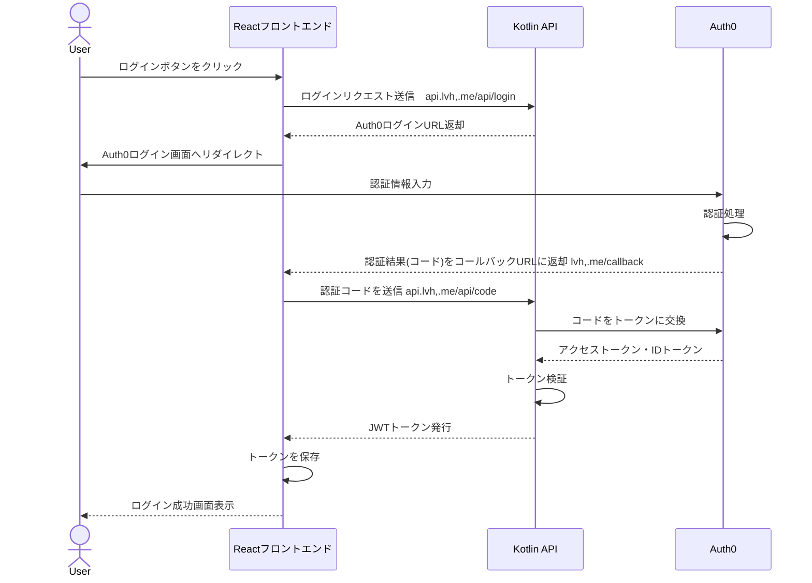

# Auth0 ログインフロー設計

## 概要

このドキュメントでは、Auth0を使用したセキュアなログイン機能の実装について説明します。セキュリティ強化のため、トークン交換や検証の処理はReactフロントエンドから直接行わず、必ずKotlin APIを経由して実行します。

## アーキテクチャ

システムは以下のコンポーネントから構成されます：

1. **Reactフロントエンド**: ユーザーインターフェースを提供
2. **Kotlin API**: バックエンドAPIとして機能し、Auth0との通信を担当
3. **Auth0**: 認証プロバイダー

## ログインフロー

## 詳細フロー

1. **ログイン開始**:
   - ユーザーがReactアプリケーションでログインボタンをクリック
   - ReactアプリがKotlin APIの `/api/auth/login` エンドポイントにリクエスト
   - APIがAuth0ログインURLを生成してフロントエンドに返す
   - フロントエンドがユーザーをAuth0ログイン画面にリダイレクト

2. **認証プロセス**:
   - ユーザーがAuth0でログイン認証を実行
   - 認証成功後、Auth0はフロントエンドのコールバックURL (`http://lvh.me/callback`) にリダイレクト（認証コード付き）

3. **認証コード交換**:
   - フロントエンドが認証コードを取得
   - フロントエンドは認証コードをKotlin APIの `/api/auth/callback` エンドポイントに送信
   - Kotlin APIはコードをAuth0に送信し、アクセストークンとIDトークンを取得
   - Kotlin APIはトークンを検証し、ユーザー情報を取得

4. **セッション確立**:
   - Kotlin APIがJWTトークンを生成
   - トークンをReactフロントエンドに返す
   - フロントエンドはトークンをローカルストレージに保存

5. **認証状態維持**:
   - フロントエンドは保存されたトークンを使用してAPIリクエストを認証
   - トークン有効期限切れの場合はリフレッシュトークンを使用して更新

## セキュリティ考慮事項

1. **CSRF対策**:
   - State パラメータを使用してCSRF攻撃を防止

2. **XSS対策**:
   - トークンの適切な管理と保護
   - Content Security Policyの実装

3. **トークン管理**:
   - アクセストークンの有効期限を短く設定（例：1時間）
   - リフレッシュトークンの安全な保管と管理

## 実装計画

1. Kotlin APIに認証関連エンドポイントを実装:
   - `/api/auth/login`: ログインURL生成
   - `/api/auth/callback`: 認証コード処理とトークン交換
   - `/api/auth/refresh`: トークンリフレッシュ
   - `/api/auth/logout`: ログアウト処理

2. Reactフロントエンドに認証関連コンポーネントを実装:
   - ログインボタン
   - コールバック処理
   - 認証状態管理
   - 保護されたルート

3. 環境設定:
   - Auth0テナント設定
   - アプリケーション登録
   - APIの設定とスコープ定義 