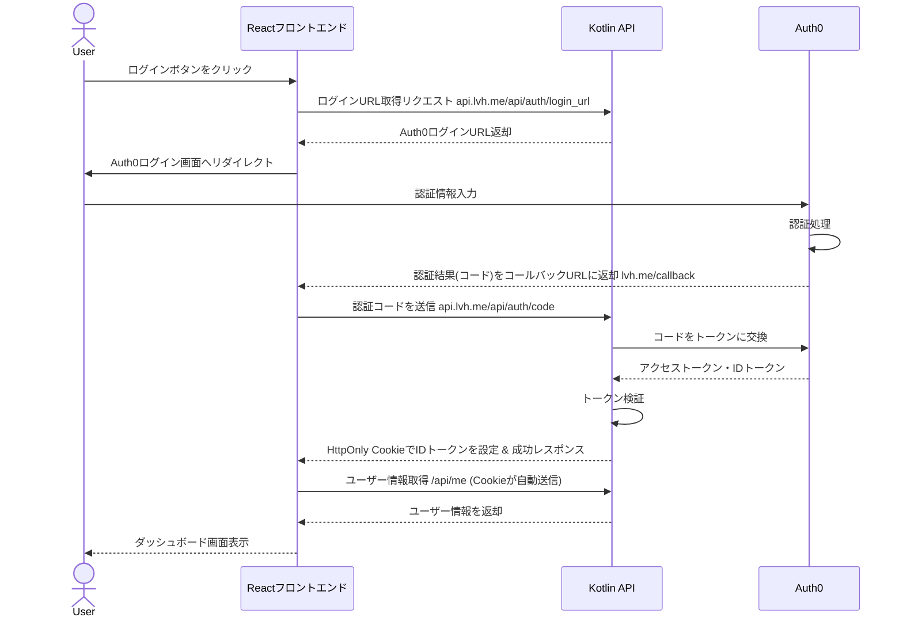
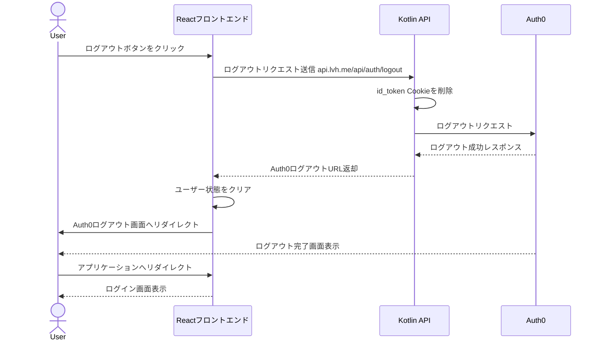

# Auth0 ログインフロー設計

## 概要

このドキュメントでは、Auth0を使用したセキュアなログイン機能の実装について説明します。セキュリティ強化のため、トークン交換や検証の処理はReactフロントエンドから直接行わず、必ずKotlin APIを経由して実行します。また、トークンの管理はHttpOnly Cookieを使用して行います。

## アーキテクチャ

システムは以下のコンポーネントから構成されます：

1. **Reactフロントエンド**: ユーザーインターフェースを提供
2. **Kotlin API**: バックエンドAPIとして機能し、Auth0との通信およびトークン管理を担当
3. **Auth0**: 認証プロバイダー

## ログインフロー

## 詳細フロー

1. **ログイン開始**:
   - ユーザーがReactアプリケーションでログインボタンをクリック
   - ReactアプリがKotlin APIの `/api/auth/login_url` エンドポイントにリクエスト
   - APIがAuth0ログインURLを生成してフロントエンドに返す
   - フロントエンドがユーザーをAuth0ログイン画面にリダイレクト

2. **認証プロセス**:
   - ユーザーがAuth0でログイン認証を実行
   - 認証成功後、Auth0はフロントエンドのコールバックURL (`http://lvh.me/callback`) にリダイレクト（認証コード付き）

3. **トークン交換とCookie設定**:
   - フロントエンドが認証コードを取得
   - フロントエンドは認証コードをKotlin APIの `/api/auth/code` エンドポイントに送信
   - Kotlin APIはコードをAuth0に送信し、アクセストークンとIDトークンを取得
   - Kotlin APIはトークンを検証し、IDトークンをHttpOnly Cookieとして設定
   - レスポンスとして成功ステータスを返却

4. **ユーザー情報取得とセッション確立**:
   - フロントエンドは `/api/me` エンドポイントを呼び出し
   - リクエスト時にCookieが自動的に送信される
   - バックエンドはCookieからIDトークンを取得・検証し、ユーザー情報を返却
   - フロントエンドはユーザー情報を状態管理に保存

5. **認証状態の維持**:
   - 以降のAPIリクエストではCookieが自動的に送信される
   - バックエンドはCookieのIDトークンを検証してリクエストを認可
   - トークンの有効期限が切れた場合は自動的にログアウト

## ログアウトフロー

## ログアウトフロー詳細

1. **ログアウト開始**:
   - ユーザーがReactアプリケーションでログアウトボタンをクリック
   - ReactアプリがKotlin APIの `/api/auth/logout` エンドポイントにリクエスト
   - APIがid_token Cookieを削除し、Auth0へログアウトリクエストを送信

2. **セッション終了処理**:
   - バックエンドでCookieを削除（maxAge=0を設定）
   - フロントエンドでユーザー状態をクリア（メモリ上の状態をリセット）
   - ユーザーをAuth0のログアウトURLにリダイレクト
   - Auth0がすべてのセッションをクリア

3. **ログアウト完了**:
   - Auth0がログアウト完了後、設定されたリダイレクトURLにユーザーを転送
   - アプリケーションのログイン画面に遷移

## セキュリティ考慮事項（ログアウト）

1. **完全なセッションクリア**:
   - バックエンドでのCookie削除
   - フロントエンドでのメモリ上の状態クリア
   - Auth0でのセッション終了

2. **リダイレクト制御**:
   - ログアウト後のリダイレクトURLをホワイトリストで管理
   - 不正なリダイレクト先への転送を防止

3. **ログアウト監査**:
   - ログアウトイベントのログ記録
   - セキュリティ監査のためのタイムスタンプ保存

## セキュリティ考慮事項

1. **トークン管理**:
   - id_tokenはHttpOnly, Secure属性付きCookieで管理
   - アクセストークンの有効期限を短く設定（例：1時間）
   - CookieのSameSite属性を適切に設定

2. **CSRF対策**:
   - State パラメータを使用してCSRF攻撃を防止
   - CookieのSameSite属性による保護

3. **XSS対策**:
   - HttpOnly Cookieによるトークン保護
   - Content Security Policyの実装

## 実装計画

1. Kotlin APIに認証関連エンドポイントを実装:
   - `/api/auth/login`: ログインURL生成
   - `/api/auth/callback`: 認証コード処理とトークン交換
   - `/api/auth/refresh`: トークンリフレッシュ
   - `/api/auth/logout`: ログアウト処理とCookie削除

2. Reactフロントエンドに認証関連コンポーネントを実装:
   - ログインボタン
   - コールバック処理
   - 認証状態管理（Cookieベース）
   - 保護されたルート

3. 環境設定:
   - Auth0テナント設定
   - アプリケーション登録
   - APIの設定とスコープ定義
   - Cookie設定（HttpOnly, Secure, SameSite等） 